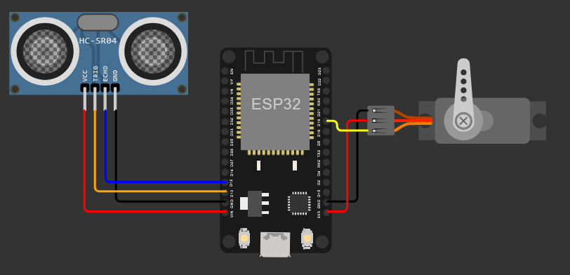

# 🗑️ Proyecto: Cesto de Basura Automático con Sensor Ultrasónico (ESP32 + MicroPython)

## 🔧 Descripción general
Este proyecto controla la apertura de la tapa de un cesto de basura de forma automática usando un **sensor ultrasónico** y un **servomotor** con un **ESP32**. Cuando una mano se acerca a **menos de 20 cm**, la tapa se abre; si no hay presencia cercana, la tapa permanece cerrada.

---

## 🛠 Componentes utilizados
- ESP32 (DevKit v1 o similar)
- Sensor ultrasónico HC-SR04 (Trig/Echo)
- Servomotor (SG90 o similar)
- Cables y protoboard
- Alimentación por USB (5V)

---

## 🔌 Diagrama de conexión
- Sensor ultrasónico HC-SR04:
  - `Trig` → GPIO13
  - `Echo` → GPIO12
  - `VCC` → 5V
  - `GND` → GND
- Servomotor:
  - Señal → GPIO19 (PWM a 50 Hz)
  - VCC → 5V (recomendable fuente separada si es posible)
  - GND → GND común con ESP32

---

## 📲 Funcionamiento
- El programa mide continuamente la distancia con el sensor ultrasónico.
- Si la distancia medida es **menor a 20 cm**, se posiciona el servo en **90°** (tapa abierta).
- Si la distancia es **mayor o igual a 20 cm**, el servo se mueve a **0°** (tapa cerrada).
- Se realiza una espera de 2 segundos entre mediciones.

  #video

---

## 🧩 Explicación del código
- Inicialización del servo en `GPIO19` con `PWM` a **50 Hz**.
- Configuración del sensor ultrasónico:
  - `Trig` como salida digital
  - `Echo` como entrada digital
- Función `medir_distancia()`:
  - Envía un pulso de 10 µs por `Trig` y mide el tiempo del pulso de `Echo` usando `ticks_us()`.
  - Calcula la distancia con la fórmula `distancia = (duración * 0.034) / 2` (velocidad del sonido en cm/µs, ida y vuelta).
- Bucle principal:
  - Obtiene `d = medir_distancia()`.
  - Si `d < 20`, mueve el servo a 90° usando `servo.duty_ns(1474326)`.
  - En caso contrario, mueve el servo a 0° usando `servo.duty_ns(456703)`.
  - Espera 2 segundos (`sleep(2)`).

---

## ▶️ Cómo usar
1. Flashea MicroPython en tu ESP32 (por ejemplo con Thonny).
2. Conecta el circuito según el diagrama.
3. Copia `main.py` a la raíz del ESP32.
4. Alimenta el servo correctamente; si usas fuente externa, comparte GND.
5. Reinicia la placa o ejecuta `main.py`.

---

## ✅ Conclusión
Una solución práctica y educativa que integra medición de distancia con **HC-SR04** y control de **servo** en **MicroPython**. Ideal para proyectos de automatización y control de movimiento.

## 👥 Integrantes
- Acosta, Franco
- Costilla, Tobias
