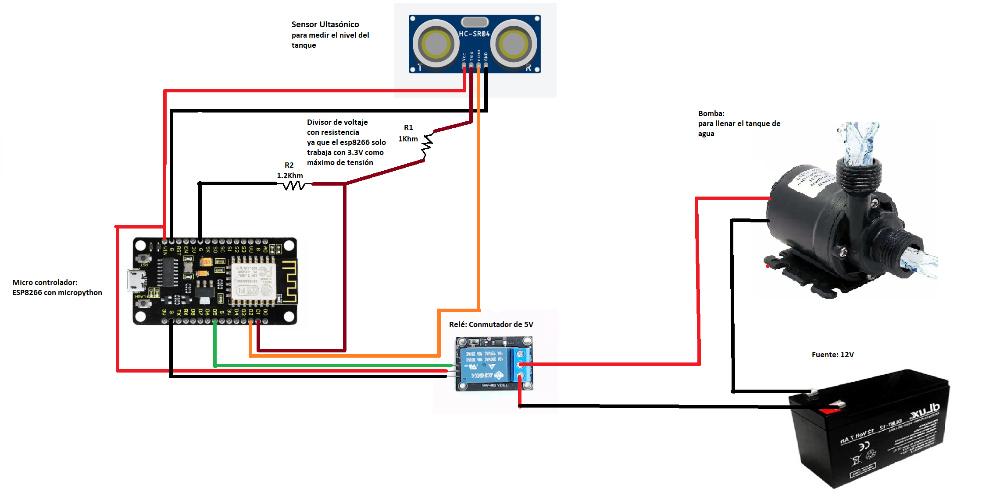

# 🚰 Proyecto: Medición de Nivel de Tanque con Control de Bomba (ESP32 + MicroPython)

## 🔧 Descripción general
Sistema de medición de **nivel de agua** en tanque utilizando **sensor ultrasónico** y **ESP32**. El nivel se calcula en porcentaje y se muestra vía **servidor web** embebido. La **bomba** se controla automáticamente según umbrales configurados:
- Nivel < 30% → Bomba ENCENDIDA
- Nivel ≥ 85% → Bomba APAGADA

Incluye modo manual desde la página web para forzar encendido/apagado de la bomba.

---

## 🛠 Componentes utilizados
- ESP32 (DevKit v1 o similar)
- Sensor ultrasónico HC-SR04
- Módulo de relé para la bomba
- Cables, protoboard y fuente 5V para la bomba (según modelo)

---

## 🔌 Diagrama de conexión
- HC-SR04:
  - Trigger → `GPIO5`
  - Echo → `GPIO4`
- Relé de bomba (activo en HIGH en este montaje):
  - Señal → `GPIO14`
  - Contactos en serie con la bomba y su fuente

---

## 📲 Funcionamiento
- El sistema mide distancia y la convierte a **nivel (%)** del tanque mapeando el valor entre `dist_min` y `dist_max`.
- Control automático:
  - Si el nivel cae por debajo de 30% → enciende la bomba.
  - Si el nivel alcanza o supera 85% → apaga la bomba.
- Interfaz web (auto-refresh 5 s):
  - Muestra modo actual (Automático/Manual), estado de bomba y barra de nivel.
  - Permite conmutar modo y encender/apagar bomba manualmente.
- API básica (`/api`) devuelve JSON con nivel, estado de bomba y modo.

  #video

---

## 🧩 Explicación del código
- Sensado:
  - Pulso de `10 µs` en `Trig` y medición con `time_pulse_us` en `Echo` (timeout 30 ms).
  - Filtro simple por promediado recortado en `medir_distancia_filtrada(n=5)`.
- Cálculo de nivel:
  - `nivel = ((dist_max - d) / (dist_max - dist_min)) * 100`, saturado a `0–100%`.
  - Valores de ejemplo: `dist_min=3 cm` (tanque lleno), `dist_max=11 cm` (tanque vacío). Ajustables según tanque real.
- Control de bomba:
  - Automático: `nivel < 30 → ON`, `nivel ≥ 85 → OFF`.
  - Manual: variables `modo_manual` y `bomba_encendida` ajustadas por querystring.
- Red/Servidor:
  - Conexión WiFi STA con timeout; servidor TCP en puerto 80; HTML con botones y barra de nivel.

---

## ▶️ Cómo usar
1. Flashea MicroPython en tu ESP32 (Thonny u otra herramienta).
2. Conecta HC-SR04 y relé según el diagrama.
3. Edita `ssid`/`password` en el código.
4. Ajusta `dist_min`/`dist_max` a tu tanque para calibrar el porcentaje.
5. Sube `main.py` y reinicia. Abre en el navegador la IP que muestra la consola.

---

## ✅ Límites y consideraciones
- El HC-SR04 tiene zona ciega (~2–3 cm) y rango útil típico 3–400 cm.
- Evitar salpicaduras/espuma directamente frente al sensor; promediar lecturas ayuda.
- Asegura un GND común y alimentación estable para evitar resets del ESP32 al conmutar.

## 👥 Integrantes
- Alderete, Jonathan
- Angelillo, Alessandro
