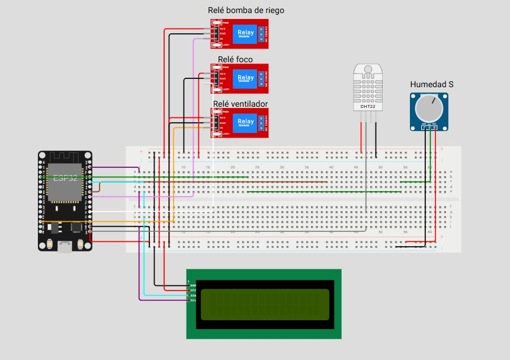

# 🪴 Proyecto: Invernadero Automatizado con ESP32, Sensores y Relés

## 🔧 Descripción general
Este proyecto automatiza el control de un pequeño invernadero usando un **ESP32**. Mide en tiempo real la **temperatura** y **humedad ambiental** (DHT22) y la **humedad del suelo** (sensor analógico). Con esa información controla tres actuadores mediante **módulos relé**:
- Bomba de agua (riego)
- Foco (iluminación/calor)
- Ventilador (circulación y enfriamiento)

Los datos se muestran en una **pantalla LCD I2C 16x2** y también se envían a **ThingSpeak** cada 15 segundos para monitoreo remoto.

---

## 🛠 Componentes utilizados
- ESP32 DevKit v1 (o similar)
- Sensor DHT22 (temperatura y humedad ambiental)
- Sensor de humedad de suelo (analógico)
- 3 módulos relé (bomba, foco, ventilador)
- Pantalla LCD I2C 16x2 (dirección 0x27)
- Fuente de alimentación estable para ESP32 y periféricos
- Cables y protoboard

> Nota: Los relés usados son de tipo **activo en LOW** (0 = ON, 1 = OFF).

---

## 🔌 Diagrama de conexión

- DHT22 → `GPIO15`
- Sensor humedad del suelo (analógico) → `ADC GPIO34`
- Relé bomba → `GPIO5`
- Relé foco → `GPIO13`
- Relé ventilador → `GPIO4`
- LCD I2C → `SDA GPIO21`, `SCL GPIO22` (dirección `0x27`)
- GND y VCC comunes para todos los módulos

---

## 📲 Funcionamiento
- El ESP32 lee periódicamente:
  - Temperatura y humedad ambiental del DHT22
  - Humedad del suelo vía ADC y la convierte a porcentaje 0–100 %
- Lógica de control de relés:
  - Bomba: se **activa** si la humedad del suelo es menor o igual al **40 %** (suelo seco)
  - Foco: se **activa** si la temperatura es menor o igual a **30 °C**
  - Ventilador: se **activa** si la temperatura es mayor a **30 °C**
- La pantalla LCD muestra: `T:xxC H:yy%` en la primera línea y `Suelo:zz%` en la segunda. Se actualiza cada segundo.
- Envío a ThingSpeak con período de **15 segundos** (temperatura, humedad ambiente, humedad de suelo).

---

## 🧩 Explicación del código
- Conectividad:
  - Conexión WiFi con SSID/clave configurables para enviar datos a ThingSpeak
- Sensores:
  - `DHT22` en `GPIO15` con manejo de errores de lectura
  - `ADC` en `GPIO34` con `atten(ADC.ATTN_11DB)` y `width(12 bits)` para rango completo
  - Conversión del valor analógico a porcentaje de humedad de suelo
- Actuadores (relés activos en LOW):
  - Funciones `rele_encender(pin)` → `pin.value(0)` y `rele_apagar(pin)` → `pin.value(1)`
  - Control condicional para bomba, foco y ventilador según umbrales
- Visualización:
  - `SoftI2C (SDA=21, SCL=22)` + `I2cLcd(0x27, 2, 16)` para imprimir mediciones en la LCD
- Telemetría:
  - Petición HTTP GET a ThingSpeak (`api.thingspeak.com/update`) cada 15 s con `field1..field3`

---

## ▶️ Cómo usar
1. Flashea MicroPython en tu ESP32 (por ejemplo con Thonny).
2. Conecta el circuito según el diagrama.
3. Copia a la placa los archivos: `main.py`, `i2c_lcd.py`, `lcd_api.py` y asegúrate de tener `dht` disponible en tu firmware.
4. Edita en `main.py` tus credenciales WiFi (`wifi_nombre`, `wifi_clave`), `api_key` y verifica la `url_envio` de ThingSpeak.
5. Ajusta si es necesario el cálculo de humedad del suelo y el umbral del 40 % según tu sensor.
6. Ejecuta `main.py`. Revisa los datos en la LCD y en tu canal de ThingSpeak.

---

## 🎥 Video

  <a href="https://youtu.be/7HkMqwU0KWE?si=YOhzz-yTeil9utCd" target="_blank">Ver demostración en YouTube</a>

---

## ✅ Conclusión
Un sistema integral y eficiente para el cuidado automatizado de cultivos en invernadero, combinando sensores ambientales y de suelo con actuadores controlados por relés, visualización local en LCD y monitoreo remoto vía Internet. Ideal como base para proyectos de **agricultura inteligente** y **domótica**.

## 👥 Integrantes
- Barrionuevo, Cristian Gabriel
- Amado, Lautaro
- Agüero, Jesús
- Mereles, Miguel

