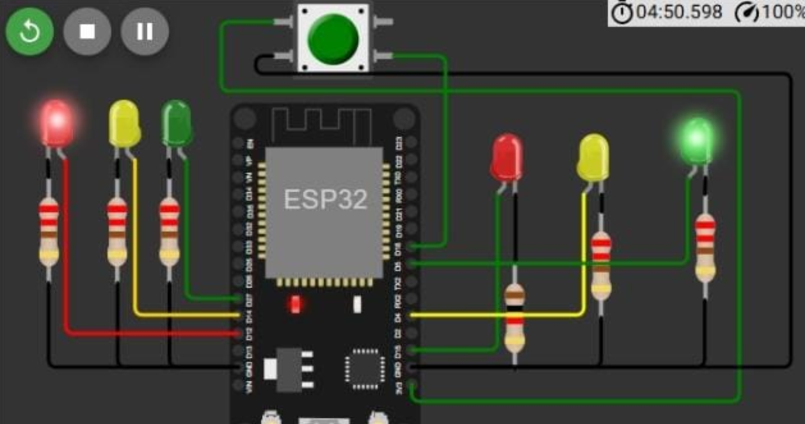

# 🚦 Proyecto: Semáforo con Solicitud de Cruce Peatonal (ESP32 + MicroPython)

## 🔧 Descripción general
Sistema de control de **intersección** con dos semáforos vehiculares y un **botón de cruce peatonal**. La secuencia alterna los estados entre ambas Calles con tiempos definidos, y cuando un peatón presiona el botón, el sistema **interrumpe la circulación** en un punto seguro y coloca **ambos en rojo** durante un tiempo para permitir el cruce.

---

## 🛠 Componentes utilizados
- ESP32 (DevKit v1 o similar)
- 2 juegos de LEDs (rojo, amarillo, verde) para semáforos
- 1 pulsador (botón peatonal)
- Resistencias para LEDs
- Protoboard y cables

---

## 🔌 Diagrama de conexión
- Semáforo 1:
  - Rojo → `GPIO12`
  - Amarillo → `GPIO14`
  - Verde → `GPIO27`
- Semáforo 2:
  - Rojo → `GPIO15`
  - Amarillo → `GPIO4`
  - Verde → `GPIO5`
- Botón de cruce:
  - Señal → `GPIO18` con `Pin.PULL_DOWN`
  - El otro terminal a 3V3

---

## 📲 Funcionamiento
- Secuencia cíclica (tiempos por fase):
  - Calle 1 Verde 5 s → Amarillo 2 s → Rojo
  - Calle 2 Verde 5 s → Amarillo 2 s → Rojo

- Solicitud peatonal: el código verifica el botón en cada fase y, si detecta una pulsación , fuerza **ambos semáforos en rojo** por 5 s y luego retoma la secuencia.

  https://github.com/user-attachments/assets/2aa33e30-6372-43db-a80d-dbc2fab9e679

---

## 🧩 Explicación del código
- Configuración:
  - Salidas digitales para cada LED de ambos semáforos.
  - Entrada digital para el botón con `Pin.PULL_DOWN`.
- Lógica de control:
  - Bloques de fase con `sleep()` para temporizar.
  - En cada fase se chequea el botón: si `boton.value()==1` y se activan ambos rojos 5 s.
- Ventaja: implementación sencilla y legible.
- Limitación: al usar `sleep()`, la verificación del botón ocurre en puntos concretos (no es tiempo real estricto por lo que el peaton debe dejar el boton presionado hasta que se habilite su cruce).

---

## ▶️ Cómo usar
1. Flashea MicroPython en tu ESP32.
2. Conecta LEDs y pulsador según el diagrama.
3. Sube `main.py` a la placa.
4. Alimenta y observa la secuencia. Presiona el botón para solicitar cruce peatonal.

---

## ✅ Consideraciones y límites
- Agrega resistencias de 220–330 Ω a cada LED.
- Si se requiere respuesta más inmediata al botón, se puede usar una **interrupción (IRQ)** o una **máquina de estados no bloqueante** con `ticks_ms()` en lugar de `sleep()`.

## 👥 Integrantes
- Borquez, Julian
- Saldivar, Leandro
- Albornoz, Roman
