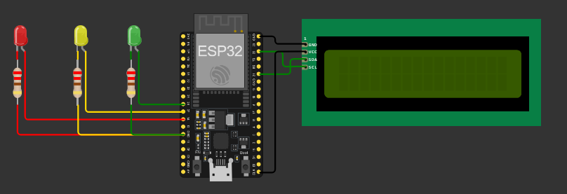

# 🚦 Proyecto: Semáforo con LCD (ESP32 + MicroPython)

## 🔧 Descripción general
Este proyecto simula el funcionamiento de un **semáforo** utilizando **tres LEDs** (rojo, amarillo y verde) controlados por un **ESP32**. Además, muestra mensajes en una **pantalla LCD 16x2 (I2C)** acordes al estado del semáforo:
- Rojo → «ALTO»
- Amarillo → «PRECAUCIÓN»
- Verde → «AVANZA»

El ciclo se ejecuta de forma continua con temporizaciones: rojo 2 s, amarillo 2 s y verde 3 s.

---

## 🛠 Componentes utilizados
- ESP32 (DevKit v1 o similar)
- Pantalla LCD 16x2 con interfaz I2C (dirección 0x27)
- 3 LEDs (rojo, amarillo, verde)
- 3 resistencias para LED (220–330 Ω)
- Cables y protoboard
- Alimentación por USB (5V)

---

## 🔌 Diagrama de conexión
- LCD I2C:
  - `SCL` → GPIO22
  - `SDA` → GPIO21
  - Dirección I2C: `0x27`
- LEDs:
  - LED Rojo → GPIO14 (con resistencia en serie a 3.3V o GND según conexión)
  - LED Amarillo → GPIO27 (ídem)
  - LED Verde → GPIO26 (ídem)

---

## 📲 Funcionamiento
- El programa define tres funciones: `encender_rojo()`, `encender_amarillo()` y `encender_verde()`.
- Cada función enciende el LED correspondiente, apaga los otros, limpia el LCD y muestra el texto asociado.
- Las duraciones son: Rojo 2 s, Amarillo 2 s, Verde 3 s.
- La función `semaforo()` repite el ciclo de forma indefinida.

  #video

---

## 🧩 Explicación del código
- Importaciones: `machine.Pin`, `machine.I2C`, `time.sleep` y `I2cLcd` para manejar pines, bus I2C, temporización y LCD.
- LCD: se inicializa con `I2C(0, scl=Pin(22), sda=Pin(21), freq=400000)` y `I2cLcd(i2c, 0x27, 2, 16)`.
- LEDs: se configuran como salidas en `GPIO14`, `GPIO27`, `GPIO26`.
- Funciones de estado: cada una asegura estado mutualmente excluyente de LEDs y escribe el mensaje en LCD (`lcd.clear()` + `lcd.putstr(...)`).
- Bucle principal: `semaforo()` llama en orden a las tres funciones, manteniendo los tiempos definidos, y se invoca al final del script para ejecutar automáticamente.

---

## ▶️ Cómo usar
1. Flashea MicroPython en tu ESP32 (por ejemplo con Thonny).
2. Conecta el circuito según el diagrama.
3. Copia a la raíz del ESP32 los archivos: `main.py`, `lcd_api.py`, `i2c_lcd.py`.
4. Reinicia la placa o ejecuta `main.py`.

---

## ✅ Conclusión
Un ejemplo claro y didáctico para comprender control digital de salidas, manejo de tiempos y uso de **LCD I2C** en **MicroPython**. La estructura por funciones facilita ampliar el comportamiento (por ejemplo, tiempos configurables o modos manual/automático).

## 👥 Integrantes
- Brandan, Tamara Anahi
- Mercado, SOfia
