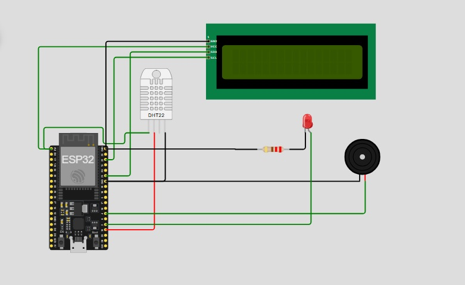

# 🌡️ Proyecto: Control de Temperatura y Humedad con Alarma (ESP32 + MicroPython)

## 🔧 Descripción general
Este proyecto utiliza un **ESP32** para leer **temperatura** y **humedad** del ambiente mediante un **sensor DHT22** y mostrar los datos en una **pantalla LCD 16x2 por I²C**. Cuando la temperatura supera un **límite configurado (30 °C)**, se activa una **alarma visual y sonora**: se enciende un **LED** y suena un **buzzer**.

Aplicable a control ambiental en invernaderos, salas con equipamiento sensible o proyectos educativos.

---

## 🛠 Componentes utilizados
- ESP32 (DevKit v1 o similar)
- Sensor DHT22 (temperatura y humedad)
- Pantalla LCD 16x2 con interfaz I²C (dirección 0x27)
- LED (alarma visual)
- Buzzer PWM (alarma sonora)
- Resistencias/cables para montaje en protoboard

---

## 🔌 Diagrama de conexión
- DHT22:
  - Datos → `GPIO15`
  - VCC → 3V3/5V (según módulo)
  - GND → GND
- LCD I²C:
  - `SCL` → `GPIO22`
  - `SDA` → `GPIO21`
  - Dirección → `0x27` (o `0x3F` según tu módulo)
- Alarmas:
  - LED → `GPIO2`
  - Buzzer (PWM) → `GPIO4`

---

## 📲 Funcionamiento
- Cada 2 s se mide la temperatura y humedad con el DHT22.
- Visualización en LCD:
  - Temperatura normal (≤ 30 °C):
    - Línea 1: `Temp: xx.xC`
    - Línea 2: `Hum: yy.y%`
  - Temperatura alta (> 30 °C):
    - Línea 1: `Temperatura Alta`
    - Línea 2: `T:xx.xC H:yy.y%`
- Alarma de temperatura alta:
  - LED en `GPIO2` encendido
  - Buzzer a 1 kHz por 0.5 s

  #video

---

## 🧩 Explicación del código
- Sensado: `dht.DHT22(Pin(15))` con `sensor.measure()` y lecturas `temperature()`/`humidity()`.
- LCD I²C: `I2C(0, scl=Pin(22), sda=Pin(21), freq=400000)` y `I2cLcd(addr=0x27, 2, 16)`.
- Alarmas: LED en `GPIO2`; buzzer `PWM(Pin(4))` con `freq(1000)` y `duty(512)` en la función `alarma()`.
- Umbral configurable: `TEMP_LIMITE = 30`.
- Manejo de errores: captura `OSError` de lectura del DHT22 y continua el ciclo.

---

## ▶️ Cómo usar
1. Flashea MicroPython en tu ESP32 (por ejemplo con Thonny).
2. Conecta los componentes según el esquema.
3. Sube a la placa: `main.py`, `i2c_lcd.py`, `lcd_api.py`.
4. Ajusta `TEMP_LIMITE` según tu aplicación.
5. Ejecuta `main.py` y observa la lectura en la LCD y la alarma cuando se supere el umbral.

---

## ✅ Conclusión
Un sistema claro y extensible para monitorear **temperatura** y **humedad** con alertas visuales/sonoras, ideal para proyectos de domótica y control ambiental con **MicroPython**.

## 👥 Integrantes
- Carbajales, Rodrigo
