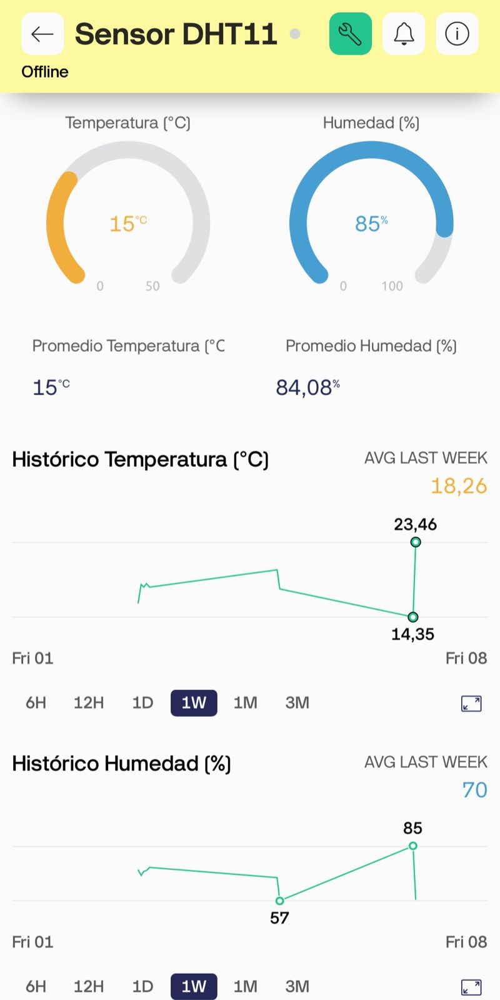
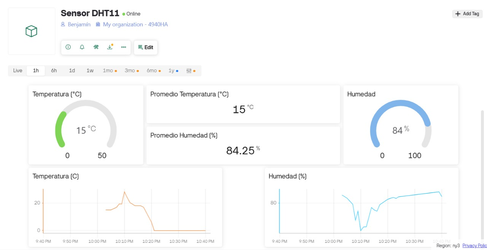
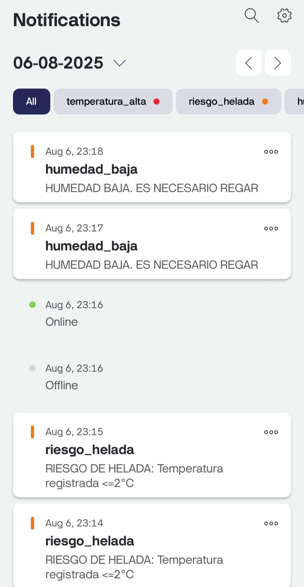
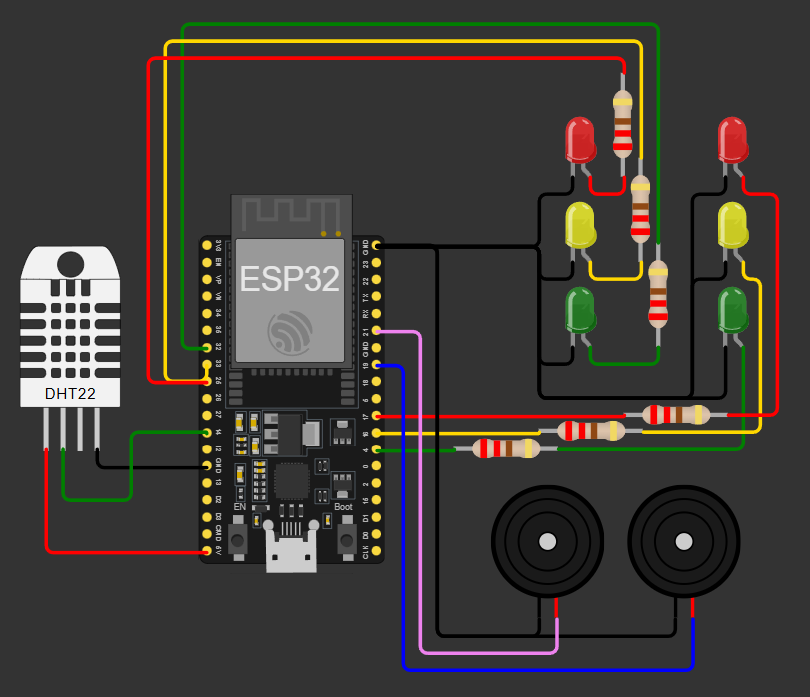

# :hotsprings::satellite: Monitoreo de Temperatura y Humedad desde Blynk IoT

## :pushpin: Descripción general
Basado en un contexto agrícola, el monitoreo de la temperatura y humedad resulta crucial para un correcto mantemiento y cuidado del huerto, pues la exposición a bajas temperaturas (<=0°C) o baja humedad por tiempo prolongado provocan daños irreversibles en los árboles frutales y varias plantas, lo cual puede derivar en pérdidas de producción elevadas.

Utilizando un sensor DHT11 se ha realizado la adquisición de valores de temperatura y humedad ambientales, los cuales serán enviados a la plataforma Blynk IoT para su visualización en tiempo real.

##### Datos visualizados en Blynk:
- Último valor registrado
- Promedio cada 1 min.
- Gráfico con el comportamiento histórico

Además se han definido notificaciones en la App de Blynk IoT, las cuales son activadas desde condiciones definidas en el código.

##### Notificaciones:
- Temperatura alta (>=35°C)
- Riesgo de helada (<=2°C)
- Helada inminente (<=0°C)
- Humedad baja (<10%)

## :ledger: Librerías
- machine
- time
- dht
- network
- BlynkLib
- BlynkTimer

## :computer: Componentes utilizados
- ESP32
- Sensor DHT11
- 6 Leds (2 Verdes, 2 Amarillos y 2 Rojos)
- 6 resistencias de 220 [Ω]
- 2 Buzzers

## :wrench: Funcionamiento general
Al ejecutarse el código se conecta a una red WiFi mediante una función que deja en pausa la ejecución del código, esto para permitir que la ESP32 se conecte sin interrupciones.

Una vez adquiridos los datos de temperatura y humedad, estos serán enviados a Blynk para su monitoreo en tiempo real de manera remota y, además, podrán ser visualizados de forma local dentro de una escala de colores.
##### Temperatura
- Verde: Rango >2°C y <=25°C
- Amarillo: Rango >25°C y <=35
- Rojo: >35°C
- Rojo (Parpadeando): <=2

##### Humedad
- Verde: >=50%
- Amarillo: Rango >=10% y <50%
- Rojo: <10%

Además se utilizaron Buzzers para generar una alarma auditiva ante condiciones extremas.
- Activación Buzzer temperatura: promedio de temperatura <= 2°C
- Activacion Buzzer humedad: promedio de humedad <= 10%

## :rocket: Diagrama de conexión
##### Sensor DHT11
- `VCC`: 5 [V]
- `GND`: GND
- `DATA`: GPIO14

##### Leds temperatura
- Verde : GPIO25
- Amarillo: GPIO33
- Rojo: GPIO32

##### Buzzer temperatura
- GPIO19

##### Leds humedad
- Verde: GPIO4
- Amarillo: GPIO16
- Rojo: GPIO17

##### Buzzer humedad
- GPIO21

## :busts_in_silhouette: Integrantes
- Cordero, Benjamín Eduardo
- González, Francisco Javier

## :movie_camera: Video del proyecto
- [Presentación Proyecto Curso MicroPython - Benjamín Cordero y Francisco González](https://youtu.be/in89rYfOzGo?si=LjFhvDAQrvyRpib1 "Presentación Proyecto Curso MicroPython - Benjamín Cordero y Francisco González")
