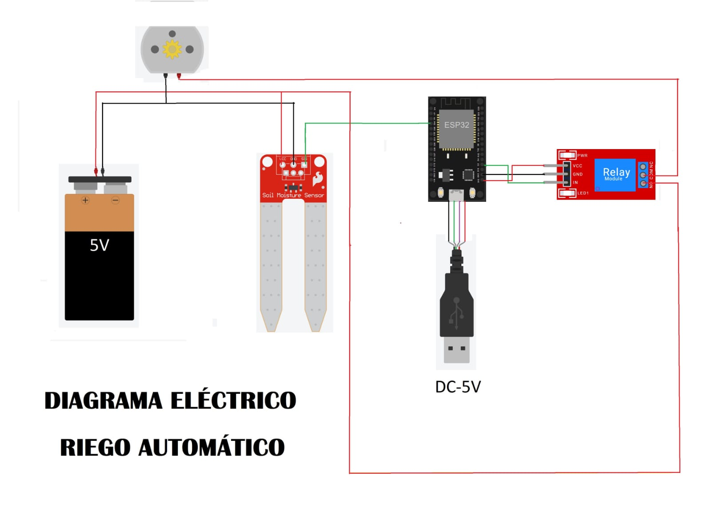

# 🌱 Proyecto: Sistema de Riego Automático (ESP32 + MicroPython)

## 🔧 Descripción general
Este proyecto implementa un **sistema de riego automático** para una planta utilizando un **ESP32**. Mide la **humedad del suelo** con un sensor analógico y, según el nivel, activa una **bomba de agua** mediante un **relé** para mantener la hidratación adecuada:
- Suelo con humedad suficiente → la bomba permanece apagada.
- Suelo con humedad baja → la bomba se enciende hasta recuperar el nivel.

---

## 🛠 Componentes utilizados
- ESP32 (DevKit v1 o similar)
- Sensor de humedad de suelo (salida analógica)
- Módulo de relé para controlar la bomba
- Bomba de agua (5V/12V según modelo)
- Fuente de alimentación adecuada para la bomba
- Cables y protoboard

> Seguridad: aísla la alimentación de la bomba del ESP32 y comparte GND solo si el relé lo requiere.

---

## 🔌 Diagrama de conexión
- Sensor de humedad:
  - Señal analógica → `GPIO34` (ADC)
  - VCC → 3V3 o 5V según sensor
  - GND → GND
- Relé/bomba:
  - Señal de control del relé → `GPIO2`
  - Contactos del relé en serie con la bomba y su fuente

---

## 📲 Funcionamiento
- Se mide la humedad del suelo con el ADC y se mapea a un porcentaje 0–100 %.
- Umbral configurado en `65 %` (ajustable):
  - Si `humedad <= 65` → el sistema enciende la bomba (`GPIO2` alto).
  - Si `humedad > 65` → apaga la bomba.
- Se imprime por consola el valor de humedad cada segundo.

  #video

---

## 🧩 Explicación del código
- Lectura analógica en `GPIO34` con `atten(ADC.ATTN_11DB)` para rango completo.
- Calibración básica con dos constantes:
  - `humedad_seco = 4095` (suelo seco)
  - `humedad_humedo = 1500` (suelo muy húmedo)
- La función `medir_humedad()` convierte el valor analógico al rango porcentual 0–100, saturando límites.
- En el bucle principal:
  - Se obtiene `humedad` y se muestra por consola.
  - Se controla el pin `GPIO2` (relé/bomba) según el umbral definido.

---

## ▶️ Cómo usar
1. Flashea MicroPython en tu ESP32 (por ejemplo con Thonny).
2. Conecta el circuito según el diagrama.
3. Copia `main.py` a la raíz del ESP32.
4. Ajusta `humedad_seco`, `humedad_humedo` y el umbral según tu sensor y planta.
5. Alimenta la bomba con su fuente adecuada y verifica el relé.
6. Ejecuta `main.py` y monitorea el porcentaje de humedad por consola.

---

## ✅ Conclusión
Un sistema simple y efectivo para automatizar el riego según la **humedad real del suelo**. Ideal para aprender lectura analógica, mapeo de valores y control de cargas mediante relé en **MicroPython**.

## 👥 Integrantes
- Coronel, Javier Oscar
- Díaz, Sergio Hernan
- Sosa Issi, Walter
