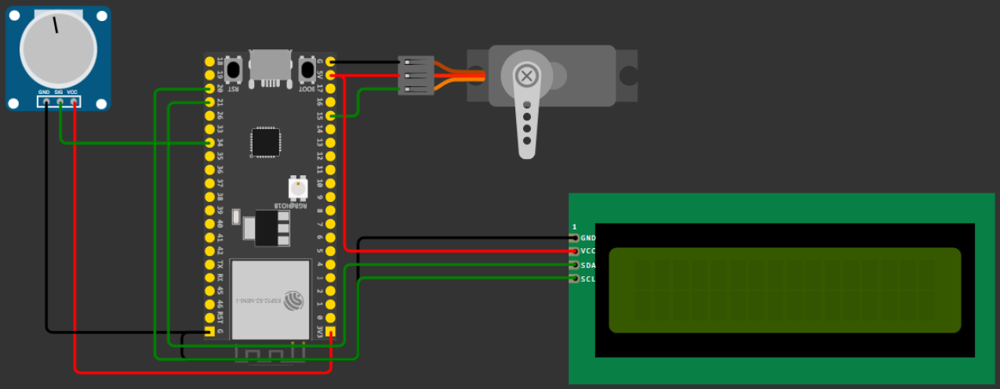
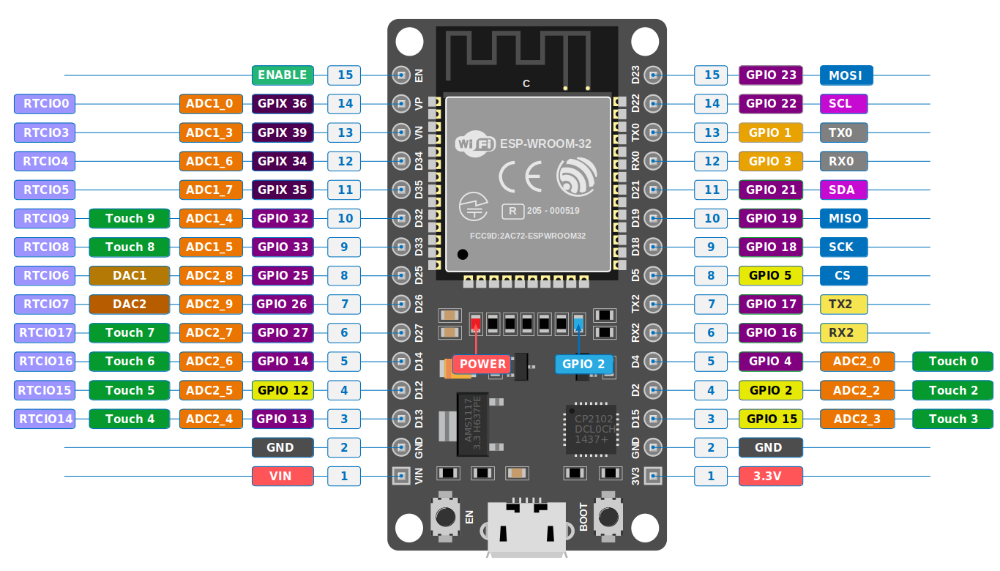
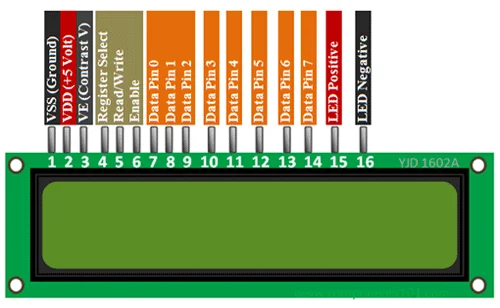
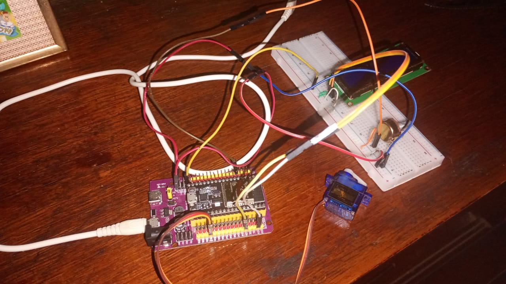
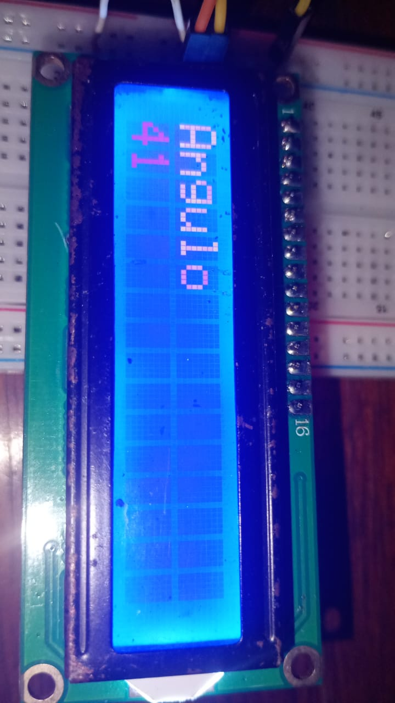
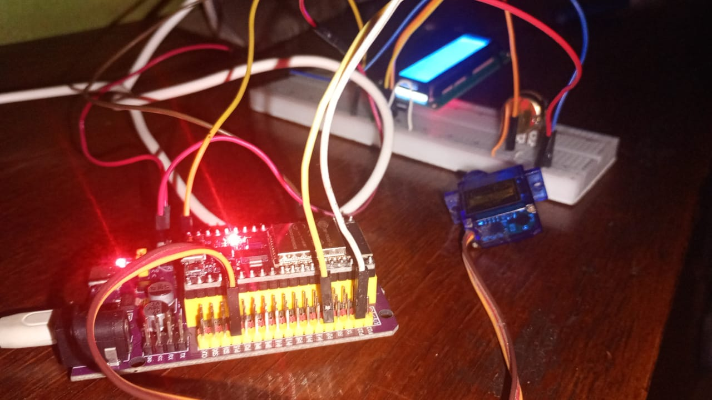

# 🔄 Control Angular con Potenciómetro y Servo (ESP32 + MicroPython)

## 🔧 Descripción general
Este proyecto muestra cómo tomar una **medida analógica** con el **ADC del ESP32** (potenciómetro) y convertirla en una **salida PWM** para controlar el **ángulo de un servomotor (0–180°)**. El ángulo calculado se visualiza en una **pantalla LCD 16x2 (I2C)** en tiempo real.

---

## 🛠 Componentes utilizados
- ESP32 (placa de desarrollo con soporte MicroPython)
- Potenciómetro 50 kΩ
- Servomotor (SG90 o similar)
- Display LCD 16x2 con interfaz I2C (0x27)
- Protoboard y cables

---

## 🔌 Diagrama de conexión

- Potenciómetro:
  - PIN1 → 3V3
  - PIN2 → `GPIO35` (ADC)
  - PIN3 → GND
- Servomotor:
  - Señal → `GPIO15` (PWM, 50 Hz)
  - VCC → 5V
  - GND → GND
- LCD 16x2 (I2C):
  - SDA → `GPIO21`
  - SCL → `GPIO22`
  - VCC/GND según módulo

## 📲 Pinout

---

## 📲 Funcionamiento
- Se lee el valor analógico del potenciómetro (`0–4095`) y se convierte a ángulo: `angulo = int(lectura * 180 / 4095)`.
- Se mapea el ángulo a un duty válido para el servo: `val = int((101/180)*angulo + 51)` y se aplica con `servo.duty(val)` a 50 Hz.
- El ángulo se muestra en el LCD (líneas 1 y 2) y se actualiza cada ~70 ms.

---

## 🧩 Explicación del código
- PWM del servo: `PWM(Pin(15)); freq(50)`.
- Entrada analógica: `ADC(Pin(35))`.
- I2C del LCD: `SoftI2C(sda=Pin(21), scl=Pin(22), freq=1_000_000)` y `I2cLcd(0x27, 2, 16)`.
- Bucle principal:
  - Limpia LCD, calcula ángulo desde el ADC, mapea a duty y mueve el servo.
  - Muestra el ángulo en pantalla y espera `70 ms`.

## 📡 Funcionamiento:
Esta práctica utiliza el concepto de entradas analógicas que requieren la conversión 
Analógica-Digital disponible en los pines de la ESP32, la función PMW para el servo motor, 
y los pines de comunicaciones SDA y SCL correspondientes a la comunicación I2C, empleando 
una lógica de conversión a ángulos para mostrar en pantalla y otra lógica para los valores 
PMW necesarios para que el servo se mueva entre 0 y 180 grados.

  https://github.com/user-attachments/assets/9ccf4914-6423-484c-ab50-03cc6d1cec1e

---

## ▶️ Cómo usar
1. Flashea MicroPython en la ESP32 (Thonny u otra herramienta).
2. Conecta los componentes según el diagrama.
3. Sube `main.py`, `i2c_lcd.py` y `lcd_api.py` a la placa.
4. Ejecuta `main.py` y gira el potenciómetro para ver el ángulo en el LCD y el movimiento del servo.

---

📌 Conclusión
Este proyecto puede ser tomado como referencia para un brazo robótico manejado con varios potenciómetros que controlan varios servos motores.

## 👥 Integrantes
- Díaz, Claudio Armando
- Ortega, Matías Adrián
