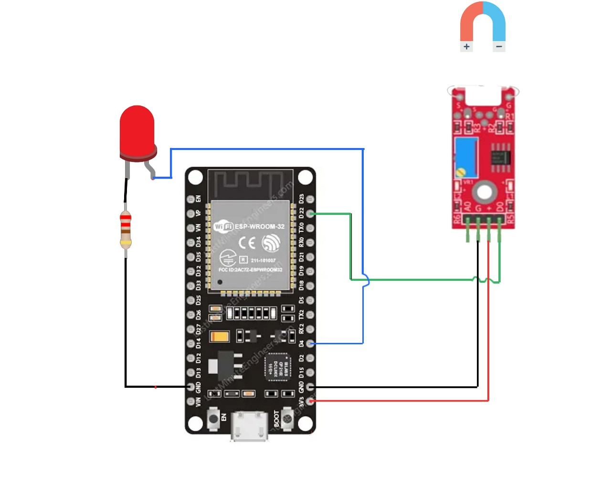

# 🚪 Proyecto: Detector de Puerta con Indicador LED (ESP32 + MicroPython)

## 🔧 Descripción general
Este proyecto implementa un sistema simple de alarma para puertas usando un **ESP32** y **MicroPython**. Un **sensor magnético** conectado al pin `GPIO22` detecta si la puerta está abierta o cerrada. Un **LED** en `GPIO4` indica el estado:
- Puerta cerrada: sistema en espera
- Puerta abierta: el LED parpadea rápidamente como alerta visual

El programa también imprime mensajes por consola para monitorear el estado del sistema.

---

## 🛠 Componentes utilizados
- Placa ESP32 (DevKit v1 o similar)
- Sensor magnético (reed switch) para puerta
- 1 LED
- 1 Resistencia para el LED (220–330 Ω)
- Cables y protoboard
- Alimentación por USB (5V)

---

## 🔌 Diagrama de conexión
- Sensor magnético (reed switch):
  - Un extremo al `GPIO22`
  - El otro extremo a `GND`
  - Se utiliza la resistencia de pull-up interna del ESP32 (`Pin.PULL_UP`)
- LED de estado:
  - Ánodo del LED → Resistencia → `GPIO4`
  - Cátodo del LED → `GND`

> Nota: Con `Pin.PULL_UP`, el pin lee `1` cuando el contacto está abierto y `0` cuando está a masa.

---

## 📲 Funcionamiento
- El sistema inicia en estado “armado”.
- Si la lectura del sensor es `1` (puerta cerrada), el sistema permanece en espera y reporta el estado por consola.
- Si la lectura es `0` (puerta abierta), el LED en `GPIO4` parpadea rápidamente (100 ms) como alerta visual y se informa por consola.

  
  https://github.com/user-attachments/assets/124ea1b1-1016-480b-b9d6-eceb47c026bf

---

## 🧩 Explicación del código
- Importaciones: `machine.Pin` para manejar pines y `time.sleep` para temporización.
- Configuración de pines:
  - `sensor = Pin(22, Pin.IN, Pin.PULL_UP)`
  - `led = Pin(4, Pin.OUT)`
- Lógica principal:
  - Con el sistema armado, se lee el estado del sensor en un bucle infinito.
  - Si la puerta está cerrada (`sensor.value() == 1`), se informa por consola.
  - Si la puerta se abre (`sensor.value() == 0`), el LED parpadea a intervalos de 100 ms.

---

## ▶️ Cómo usar
1. Flashea MicroPython en tu ESP32 (por ejemplo con Thonny).
2. Conecta el circuito según el esquema anterior.
3. Copia el archivo `main.py` a la raíz del ESP32.
4. Abre el monitor/terminal para ver los mensajes del sistema.

---

## 🚀 Mejoras a futuro
- Interfaz web para visualizar el estado de la puerta en tiempo real desde un navegador.
- Envío de alertas por WhatsApp usando una API de mensajería cuando se detecte apertura.

---

## ✅ Conclusión
Un sistema minimalista y efectivo para monitorear el estado de una puerta con feedback visual inmediato. Es una base sólida para evolucionar hacia soluciones conectadas (web/notificaciones) de bajo costo.

## 👥 Integrantes
- Ferreyra, Paula Mariel
- Galván, Sebastian Elias
- González, Imelda del Valle
