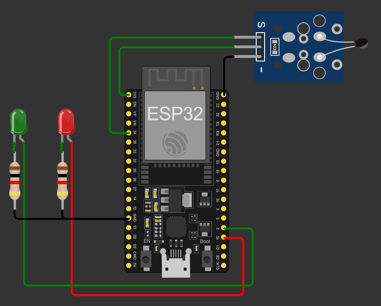

# 🔴🟢 Proyecto: Alerta Visual de Temperatura con NTC (ESP32 + MicroPython)

## 🔧 Descripción general
Sistema de alerta visual de **temperatura** usando un **termistor NTC** conectado al **ADC del ESP32**. Según el nivel leído, se enciende un **LED verde** (temperatura baja/normal) o un **LED rojo** (temperatura alta), actuando como semáforo simple.

---

## 🛠 Componentes utilizados
- ESP32 (DevKit v1 o similar)
- Termistor NTC con divisor resistivo
- 1 LED verde + resistencia serie
- 1 LED rojo + resistencia serie
- Protoboard y cables

---

## 🔌 Diagrama de conexión
- NTC (divisor resistivo):
  - Punto medio (salida analógica) → `GPIO34` (ADC)
  - Extremos del divisor → 3V3 y GND (según diseño del divisor)
- LEDs:
  - LED verde → `GPIO2` (con resistencia a GND)
  - LED rojo → `GPIO15` (con resistencia a GND)

---

## 📲 Funcionamiento
- Se lee el valor del ADC en `GPIO34` (0–4095) con atenuación `ADC.ATTN_11DB` (rango ~0–3.3V).
- Umbral configurado: `umbral_adc = 2600` (ajustable según el NTC y divisor).
- Lógica:
  - Si `lectura_adc > umbral_adc` → Temperatura baja/normal → LED verde ON, LED rojo OFF.
  - Si `lectura_adc <= umbral_adc` → Temperatura alta → LED rojo ON, LED verde OFF.
- Mensajes por consola cada 2 s con lectura y estado.

  #video

---

## 🧩 Explicación del código
- Configuración del ADC en `GPIO34` con `sensor_ntc.atten(ADC.ATTN_11DB)`.
- LEDs en `GPIO2` (verde) y `GPIO15` (rojo) como salidas digitales.
- Bucle principal: lee `sensor_ntc.read()`, compara contra `umbral_adc` y conmuta LEDs.
- Pausa de 2 s entre lecturas para estabilidad visual y de consola.

---

## ▶️ Cómo usar
1. Flashea MicroPython en tu ESP32 (Thonny u otra herramienta).
2. Conecta el NTC en divisor resistivo y los LEDs según el diagrama.
3. Ajusta `umbral_adc` según tu divisor/NTC y el punto de conmutación deseado.
4. Sube `main.py` y ejecuta; observa el LED activo y la lectura por consola.

---

## ✅ Límites y consideraciones
- El valor ADC depende del divisor NTC y de la temperatura; calibra `umbral_adc` con mediciones reales.
- Usa resistencias adecuadas para los LEDs (220–330 Ω típicas).
- Evita ruido eléctrico en la entrada ADC; puedes promediar varias lecturas si es necesario.
- La relación ADC↔temperatura no es lineal; para obtener °C exactos, implementa tabla o ecuación Beta/Steinhart–Hart.

## 👥 Integrantes
- Gonzalez Soria, Alvaro Benjamín
