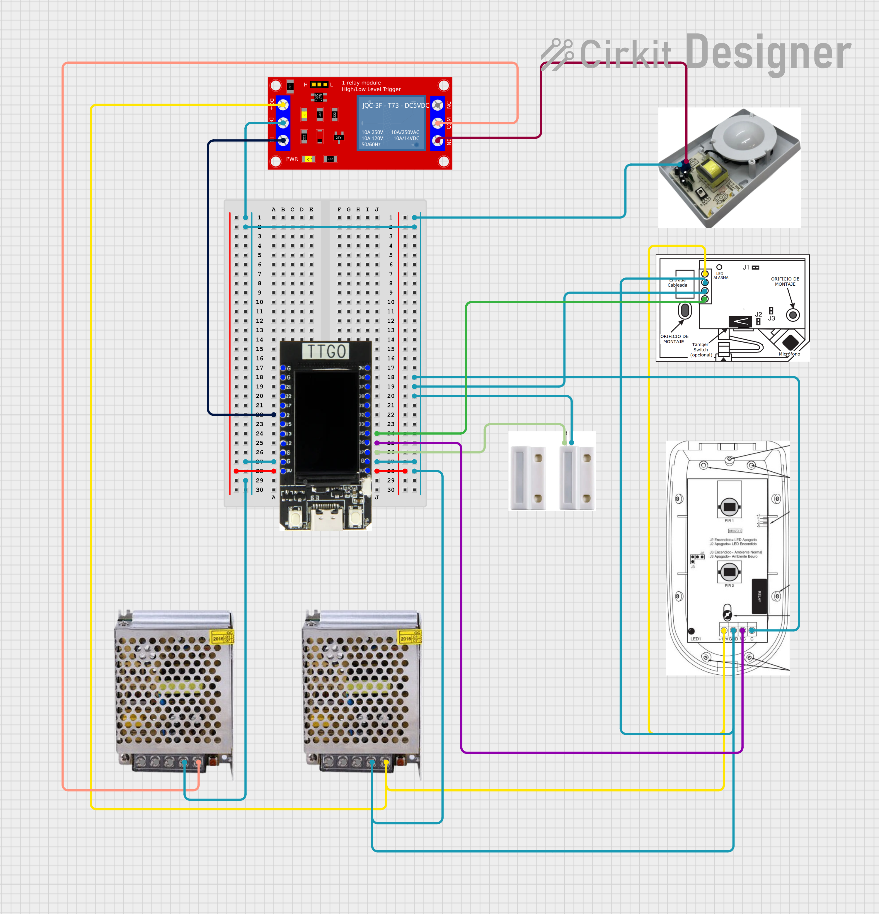

# 📡 Proyecto: Alarma Inteligente con LilyGO T-Display v1.1

## 🔧 Descripción general

Este proyecto usa una placa **LilyGO T-Display v1.1** que funciona como el cerebro del sistema. Se conecta a sensores que detectan apertura de puertas, movimiento o rotura de vidrio. Cuando la alarma está activada y alguno de estos sensores detecta algo, la placa envía una señal a un relé que enciende una sirena para alertar de la intrusión.

La LilyGO tiene también una pequeña pantalla que muestra mensajes como “alarma activada” o “alarma desactivada”, e indica qué zona se activó (por ejemplo, “puerta abierta” o “movimiento detectado”). Todo esto funciona gracias a un programa en **MicroPython** que revisa constantemente los sensores y actualiza la pantalla.

Además, la placa crea una **página web** a la que se puede acceder desde el celular o la computadora. Desde esa página se puede activar o desactivar la alarma y ver en tiempo real el estado de cada sensor, como si fuera un panel de control.

<div align="center">
  
  https://github.com/user-attachments/assets/1f1c528a-8571-4d0e-95ea-ce0769db8d96

</div>

---

## 🛠 Componentes utilizados

- LilyGO T-Display v1.1 (ESP32)  
- Sensor magnético (puerta principal)  
- Sensor PIR (movimiento)  
- Sensor de rotura de vidrio  
- Módulo de relé (para controlar la sirena)  
- Fuente externa de 5V para alimentar el módulo de relé  
- Fuente externa de 12V para alimentar PIR y sensor de rotura  
- Conexión Wi-Fi para el control web

---

## 🛠 Diagrama de conexión

- Sensor de puerta (magnético): `GPIO27`  
- Sensor PIR: `GPIO26`  
- Sensor rotura: `GPIO25`  
- Relé para sirena: `GPIO2`  
- Pantalla LCD (ST7789): Pines SPI + control:  
  - `SCK`: GPIO18  
  - `MOSI`: GPIO19  
  - `CS`: GPIO5  
  - `DC`: GPIO16  
  - `RESET`: GPIO23  
  - `Backlight`: GPIO4



---

## 📲 Funcionamiento

- La placa se conecta al Wi-Fi.  
- La pantalla LCD muestra:  
  - Estado de la alarma (ACTIVADA o DESACTIVADA)  
  - Estado de cada zona (puerta, PIR, rotura)  
- Un servidor web permite:  
  - Activar o desactivar la alarma  
  - Ver en tiempo real los estados (se actualiza cada 2 segundos)  
- Si la alarma está activada y se detecta una intrusión, se activa la sirena a través del relé.

---

## 🧩 Explicación del código

### 1️ Importaciones

```python
from machine import Pin, SPI
import network
import socket
import st7789
import vga1_8x8 as font
import time
```

✅ Librerías para:  
- Pines (Pin)  
- Comunicación SPI (pantalla)  
- Red Wi-Fi  
- Servidor web  
- Pantalla LCD  
- Fuente de texto  
- Temporización

---

### 🛠 2️ Configuración de sensores y relé

```python
sensor_puerta = Pin(27, Pin.IN, Pin.PULL_UP)
sensor_pir = Pin(26, Pin.IN, Pin.PULL_UP)
sensor_rotura = Pin(25, Pin.IN, Pin.PULL_UP)

rele_sirena = Pin(2, Pin.OUT)
rele_sirena.value(1)  # Inicia apagado (1 = desactivado, activo bajo)
```

✅ Sensores devuelven `0` cuando están tranquilos, `1` cuando se activan.

---

### 3️ Inicialización de la pantalla LCD

```python
spi = SPI(1, baudrate=40000000, sck=Pin(18), mosi=Pin(19))
tft = st7789.ST7789(spi, 135, 240,
    reset=Pin(23, Pin.OUT),
    cs=Pin(5, Pin.OUT),
    dc=Pin(16, Pin.OUT),
    backlight=Pin(4, Pin.OUT),
    rotation=1)
tft.init()
```

✅ Configura la pantalla ST7789 para mostrar información.

---

### 🌐 4️ Conexión a la red Wi-Fi

```python
ssid = "xxx"
password = "123"
wlan = network.WLAN(network.STA_IF)
wlan.active(True)
wlan.connect(ssid, password)
while not wlan.isconnected():
    time.sleep(1)
print("Conectado! IP:", wlan.ifconfig()[0])
```

✅ Se conecta a la red y muestra IP asignada.

---

### 🔁 5️ Variables de estado

```python
alarma_activada = False
prev_estado = {
    "alarma": None,
    "puerta": None,
    "pir": None,
    "rotura": None
}
```

✅ `alarma_activada`: indica si está ON u OFF  
✅ `prev_estado`: evita parpadeo de pantalla

---

### 🖊 6️ Función para dibujar texto

```python
def draw_text(label, value, y, color=st7789.WHITE):
    tft.fill_rect(10, y, 220, 20, st7789.BLACK)
    tft.text(font, f"{label}: {value}", 10, y, color)
```

✅ Borra y escribe solo la línea correspondiente.

---

### 📺 7️ Función que actualiza la pantalla

```python
def actualizar_pantalla():
    if prev_estado["alarma"] != alarma_activada:
        texto = "ACTIVADA" if alarma_activada else "DESACTIVADA"
        color = st7789.GREEN if alarma_activada else st7789.RED
        draw_text("Alarma", texto, 10, color)
        prev_estado["alarma"] = alarma_activada

    estado_puerta = sensor_puerta.value()
    if prev_estado["puerta"] != estado_puerta:
        txt = "Abierta" if estado_puerta else "Cerrada"
        draw_text("Zona1 Puerta", txt, 40)
        prev_estado["puerta"] = estado_puerta

    estado_pir = sensor_pir.value()
    if prev_estado["pir"] != estado_pir:
        txt = "Detectado" if estado_pir else "No"
        draw_text("Zona2 PIR", txt, 60)
        prev_estado["pir"] = estado_pir

    estado_rotura = sensor_rotura.value()
    if prev_estado["rotura"] != estado_rotura:
        txt = "Detectada" if estado_rotura else "No"
        draw_text("Zona3 Rotura", txt, 80)
        prev_estado["rotura"] = estado_rotura
```

✅ Solo actualiza zonas modificadas → pantalla más fluida.

---

### 🌐 8️ Página web

```python
def generar_web():
    html = f"""<html>
<head>
<title>Alarma</title>
<meta http-equiv="refresh" content="2">
</head>
<body>
<h1>Alarma {"ACTIVADA" if alarma_activada else "DESACTIVADA"}</h1>
<p>Zona1 Puerta: {"Abierta" if sensor_puerta.value() else "Cerrada"}</p>
<p>Zona2 PIR: {"Detectado" if sensor_pir.value() else "No"}</p>
<p>Zona3 Rotura: {"Detectada" if sensor_rotura.value() else "No"}</p>
<a href="/activar"><button>Activar</button></a>
<a href="/desactivar"><button>Desactivar</button></a>
</body></html>"""
    return html
```

---

### 🔌 9️ Servidor web

```python
addr = socket.getaddrinfo('0.0.0.0', 80)[0][-1]
s = socket.socket()
s.bind(addr)
s.listen(1)
s.setblocking(False)
print('Servidor web listo')
```

---

### 🔄 10️ Loop principal

```python
last_screen_update = 0

while True:
    if alarma_activada:
        if sensor_puerta.value() == 1 or sensor_pir.value() == 1 or sensor_rotura.value() == 1:
            rele_sirena.value(0)  # activa sirena
        else:
            rele_sirena.value(1)
    else:
        rele_sirena.value(1)

    now = time.ticks_ms()
    if time.ticks_diff(now, last_screen_update) > 200:
        actualizar_pantalla()
        last_screen_update = now

    try:
        conn, addr = s.accept()
        request = conn.recv(1024)
        request = str(request)
        if '/activar' in request:
            alarma_activada = True
        if '/desactivar' in request:
            alarma_activada = False
        response = generar_web()
        conn.send('HTTP/1.1 200 OK\nContent-Type: text/html\nConnection: close\n\n')
        conn.sendall(response)
        conn.close()
    except:
        pass

    time.sleep(0.05)
```

### 🌐 Interfaz web
- Botones "Activar" y "Desactivar"
- Estado de cada zona visible
- Refresco automático cada 2 segundos para ver cambios en vivo

---

## ✅ Conclusión

Este proyecto combina hardware (sensores y relé) con software en **MicroPython** para crear una **alarma conectada** y fácil de controlar desde el celular o PC. Además, la pantalla LCD permite visualizar rápidamente el estado del sistema.
