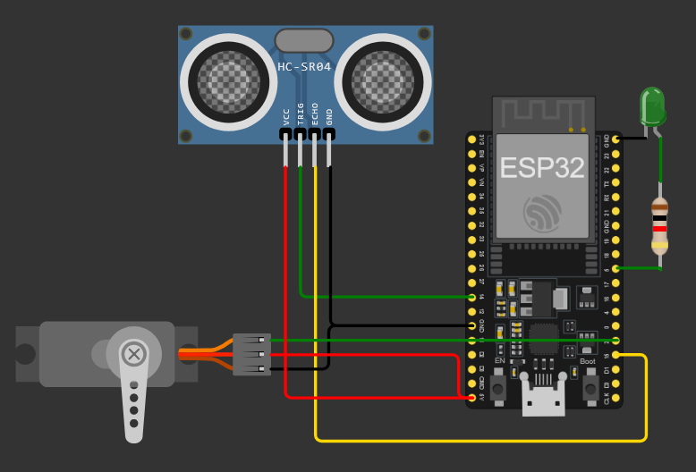

# 🚪 Proyecto: Puerta Automática con Detección de Presencia (ESP32 + MicroPython)

## 🔧 Descripción general
Este proyecto implementa una **puerta automática** controlada por un **ESP32**. Utiliza un **sensor ultrasónico** para detectar presencia frente a la puerta y un **servomotor** para abrirla o cerrarla. Además, enciende un **LED indicador** cuando se detecta una persona.

- Persona detectada (distancia < 50 cm) → Servo a 90° (puerta abierta) y LED encendido
- Sin presencia (distancia ≥ 50 cm o error de medición) → Servo a 0° (puerta cerrada) y LED apagado

---

## 🛠 Componentes utilizados
- ESP32 (DevKit v1 o similar)
- Sensor ultrasónico HC-SR04 (Trig/Echo)
- Servomotor (SG90 o similar)
- LED indicador + resistencia (220–330 Ω)
- Cables y protoboard
- Alimentación por USB (5V)

---

## 🔌 Diagrama de conexión
- Sensor ultrasónico HC-SR04:
  - `Trig` → GPIO14
  - `Echo` → GPIO15
  - `VCC` → 5V
  - `GND` → GND
- Servomotor:
  - Señal → GPIO2 (PWM a 50 Hz)
  - VCC → 5V (si es posible, fuente separada)
  - GND → GND común con el ESP32
- LED indicador:
  - Señal → GPIO5
  - Serie con resistencia a GND

> Importante: comparte GND entre todas las fuentes. El servo puede requerir fuente separada para evitar resets del ESP32.

---

## 📲 Funcionamiento
- Se mide la distancia mediante pulsos de `Trig`/`Echo` con timeout de 30 ms para evitar bloqueos.
- Si la medición es válida:
  - Si la distancia es menor a 50 cm → se abre la puerta (servo 90°) y se enciende el LED.
  - Si la distancia es mayor o igual a 50 cm → se cierra la puerta (servo 0°) y se apaga el LED.
- Si ocurre un error de medición (timeout) → por seguridad, puerta cerrada y LED apagado.
- Se imprime en consola la distancia y el estado.

  https://github.com/user-attachments/assets/75942a12-7009-4f1d-8432-8ada55d605d3

---

## 🧩 Explicación del código
- Configuración:
  - Servo: `PWM(Pin(2), freq=50)` y función `servo_angle(angle)` que mapea ángulo (0–180) a `duty`.
  - LED: `Pin(5, Pin.OUT)`.
  - Ultrasonido: `Trig` (salida) en `GPIO14`, `Echo` (entrada) en `GPIO15`.
- `medir_distancia()`:
  - Envía pulso de 10 µs en `Trig` y mide duración del pulso en `Echo` con `ticks_us()`.
  - Incluye timeout tanto en el inicio como durante el pulso alto.
  - Calcula distancia como `(duración/2)/29.1` (cm).
  - Retorna `-1` en caso de error.
- Bucle principal:
  - Lee `dist = medir_distancia()` y decide estados de servo y LED según umbral de 50 cm.
  - Espera 1 s entre lecturas.

---

## ▶️ Cómo usar
1. Flashea MicroPython en tu ESP32 (por ejemplo con Thonny).
2. Conecta el circuito según el diagrama.
3. Copia `main.py` a la raíz del ESP32.
4. Si usas fuente externa para el servo, comparte GND con el ESP32.
5. Reinicia la placa o ejecuta `main.py`.

---

## ✅ Conclusión
Un proyecto práctico de **automatización** que integra medición por **ultrasonido**, control de **servo** y señalización con **LED** usando **MicroPython**. Base ideal para puertas automáticas, dispensadores o sistemas de acceso sin contacto.

## 👥 Integrantes
- Navarro, David Elias
- Cisneros, Sergio Mauricio
- Manca, Angel Mariano
