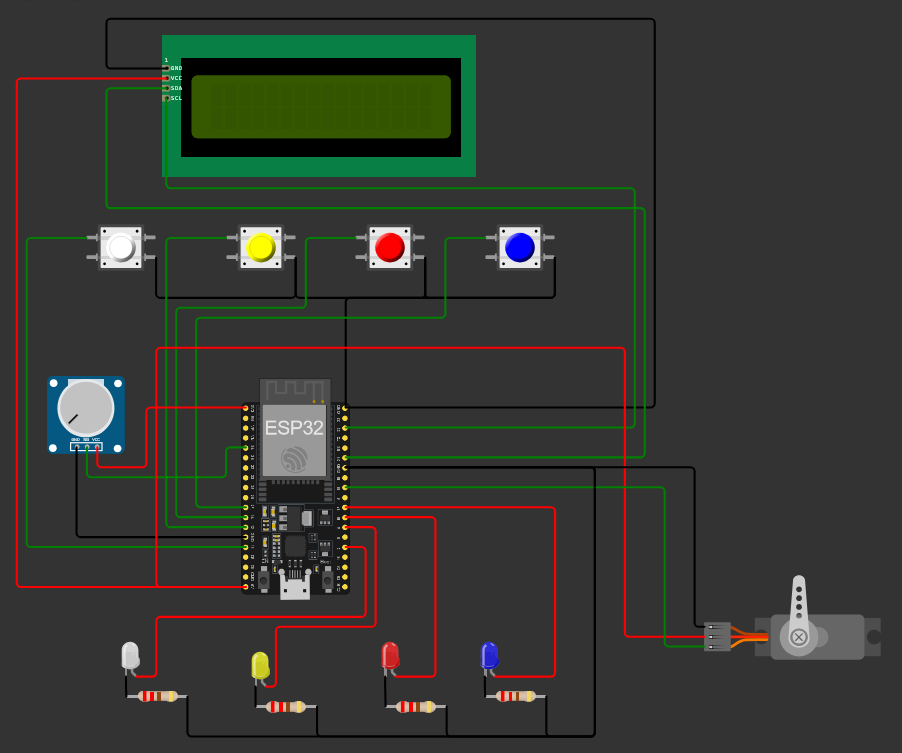

# 🥤 Proyecto: Dispensador de Bebidas con ESP32

## 🔧 Descripción general

Este proyecto implementa un **dispensador de bebidas automático** usando un microcontrolador ESP32. El sistema permite seleccionar entre 4 tipos de bebidas diferentes (Agua, Fanta, Coca, Sprite) mediante botones. Los leds representan la bomba de cada bebida y con el potenciometro seleccionamos el brillo de cada led, que representa el tiempo de vaciado de cada bomba.

El dispensador cuenta con una pantalla LCD que muestra las opciones disponibles y confirma la selección del usuario. Un servomotor simula el mecanismo de dispensado, realizando un movimiento de ida y vuelta cuando se selecciona una bebida. El brillo de los LEDs se controla mediante un potenciómetro, permitiendo ajustar la intensidad lumínica según las preferencias del usuario (que en el proyecto real representa el tiempo de vaciado de la bomba).

Todo el sistema está programado en **MicroPython** y proporciona una experiencia interactiva y visual para la selección de bebidas.

<div align="center">
  
  https://github.com/user-attachments/assets/82d85a58-6ca8-4903-a424-b4320fe1956f
  
</div>
---

## 🛠 Componentes utilizados

- ESP32 DevKit v1
- Display LCD 16x2 con módulo I2C
- 4 Botones pulsadores (selección de bebidas)
- 4 LEDs
- 4 Resistencias de 100Ω
- 1 Potenciómetro
- 1 Servomotor

---

## 🛠 Diagrama de conexión

### Conexiones principales:

**Display LCD I2C:**
- `SCL`: GPIO22
- `SDA`: GPIO21
- `VCC`: 5V
- `GND`: GND

**Botones:**
- Botón 1 (Agua): `GPIO13`
- Botón 2 (Fanta): `GPIO12`
- Botón 3 (Coca): `GPIO14`
- Botón 4 (Sprite): `GPIO27`

**LEDs (con PWM):**
- LED 1 (Agua): `GPIO2`
- LED 2 (Fanta): `GPIO4`
- LED 3 (Coca): `GPIO16`
- LED 4 (Sprite): `GPIO17`

**Otros componentes:**
- Potenciómetro: `GPIO34` (ADC)
- Servomotor: `GPIO18` (PWM)



---

## 📲 Funcionamiento

- El sistema muestra en pantalla las opciones de bebidas disponibles
- El usuario selecciona una bebida presionando el botón correspondiente
- El LED asociado se enciende con el brillo configurado por el potenciómetro
- La pantalla muestra la confirmación de la bebida seleccionada
- El servomotor simula el dispensado realizando un movimiento completo
- Después de 2 segundos, el sistema vuelve al estado inicial

---

## 🧩 Explicación del código

### 1️⃣ Importaciones y configuración inicial

```python
from machine import Pin, PWM, ADC, I2C
from time import sleep
from lcd_api import LcdApi
from i2c_lcd import I2cLcd
```

✅ Librerías para:
- Control de pines y PWM
- Comunicación I2C (pantalla LCD)
- Conversión analógico-digital (potenciómetro)
- Temporización del sistema

---

### 2️⃣ Configuración del hardware

```python
# LCD
i2c = I2C(0, scl=Pin(22), sda=Pin(21), freq=400000)
lcd = I2cLcd(i2c, 0x27, 2, 16)

# Pulsadores
buttons = [Pin(13, Pin.IN, Pin.PULL_UP),
           Pin(12, Pin.IN, Pin.PULL_UP),
           Pin(14, Pin.IN, Pin.PULL_UP),
           Pin(27, Pin.IN, Pin.PULL_UP)]

# LEDs PWM
led_pins = [2, 4, 16, 17]
leds = [PWM(Pin(pin), freq=1000) for pin in led_pins]
```

✅ Configuración de pantalla LCD I2C con dirección 0x27
✅ Botones con resistencias pull-up internas
✅ LEDs configurados con PWM para control de brillo

---

### 3️⃣ Sensores analógicos y actuadores

```python
# Potenciómetro
pot = ADC(Pin(34))
pot.atten(ADC.ATTN_11DB)

# Servo
servo = PWM(Pin(18), freq=50)
```

✅ ADC configurado para rango completo (0-3.3V)
✅ Servomotor con frecuencia de 50Hz estándar

---

### 4️⃣ Configuración de mensajes

```python
mensajes = ["Agua seleccionada", "Fanta seleccionada", "Coca seleccionada", "Sprite seleccionada"]

# Mensaje inicial
lcd.clear()
lcd.putstr("Elija su bebida \n1=Agua 2=Fanta \n3=Coca 4=Sprite")
```
---

### 5️⃣ Función de dispensado (servomotor)

```python
def mover_servo():
    for i in range(40, 115):
        servo.duty(i)
        sleep(0.01)
    for i in range(115, 40, -1):
        servo.duty(i)
        sleep(0.01)
```
---

### 6️⃣ Loop principal del sistema

```python
while True:
    brillo = int((pot.read() / 4095) * 1023)  # 0–1023

    for i, btn in enumerate(buttons):
        if not btn.value():
            # Apagar todos los LEDs
            for led in leds:
                led.duty(0)

            # Encender el LED correspondiente con brillo
            leds[i].duty(brillo)

            # Mostrar mensaje en pantalla
            lcd.clear()
            lcd.putstr(mensajes[i])

            # Mover servo
            mover_servo()
            
            sleep(2)

            # Reset visual
            lcd.clear()
            lcd.putstr("Elija su bebida:\n1=Agua 2=Fanta\n3=Coca 4=Sprite")

            # Apagar LEDs
            for led in leds:
                led.duty(0)

    sleep(0.1)
```
---

### 🎛️ Características principales

- **Control de brillo**: Ajuste en tiempo real mediante potenciómetro
- **Interfaz intuitiva**: Pantalla LCD con mensajes claros
- **Simulación realista**: Movimiento de servo para dispensado
- **4 opciones**: Diferentes bebidas con LEDs identificadores
- **Reset automático**: Vuelta al estado inicial después del dispensado

---

## ✅ Conclusión

Este proyecto demuestra la integración de múltiples componentes (sensores, actuadores, displays) en un sistema funcional usando **MicroPython**. El dispensador de bebidas combina interfaces digitales y analógicas para crear una experiencia de usuario completa e interactiva, ideal para aprender conceptos de automatización y control de hardware.

## 👥 Integrantes

- Navarro David
- Tapia Marcelo Benjamin 
- Yoris Jorge Emiliano

## 🔧 Simulacion

[Ver simulación en Wokwi](https://wokwi.com/projects/437820843024755713)
