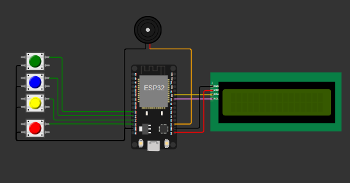

# 🖥️ Proyecto: Mensajes en LCD con Botonera y Buzzer (ESP32 + MicroPython)

## 🔧 Descripción general
Este proyecto utiliza una placa **ESP32** para mostrar mensajes en una **pantalla LCD 16x2 (I2C)** según el botón que se presione. Además, se reproduce un **tono en un buzzer** utilizando PWM para dar una retroalimentación audible.

- Botón Verde → Muestra “Hola, como estas?” y suena un tono de 440 Hz
- Botón Azul → Muestra “Bienvenidos al mundo digital” y suena un tono de 523 Hz
- Botón Amarillo → Muestra “Codifica con imaginacion” y suena un tono de 587 Hz
- Botón Rojo → Muestra “Proyecto MicroPython” y suena un tono de 659 Hz

Cada pulsación limpia la pantalla, imprime el mensaje (en 2 líneas cuando corresponde) y hace sonar el buzzer durante ~0,3 s. Los botones usan `PULL_UP` interno (activos en nivel bajo).

---

## 🛠 Componentes utilizados
- ESP32 (DevKit v1 o similar)
- Pantalla LCD 16x2 con interfaz I2C (dirección 0x27)
- 4 botones pulsadores (verde, azul, amarillo, rojo)
- Buzzer pasivo (controlado por PWM)
- Cables y protoboard
- Alimentación por USB (5V)

---

## 🔌 Diagrama de conexión
- LCD I2C (por `SoftI2C`):
  - `SDA` → GPIO19
  - `SCL` → GPIO18
  - Dirección I2C: `0x27`
- Botones (con `Pin.PULL_UP`, activos en 0):
  - Verde → GPIO27
  - Azul → GPIO14
  - Amarillo → GPIO12
  - Rojo → GPIO13
- Buzzer (PWM):
  - Señal → GPIO15
  - GND → GND

---

## 📲 Funcionamiento
- Al iniciar, el LCD queda listo para mostrar mensajes.
- En el bucle principal se leen los 4 botones. Al detectar una pulsación (valor 0):
  - Se limpia el LCD y se escribe el mensaje correspondiente (usando salto de línea `\n` para la segunda línea).
  - Se genera un tono con `PWM` en el buzzer (frecuencias: 440, 523, 587, 659 Hz) durante ~0,3 s.
  - Se aplica un pequeño retardo (`sleep_ms(300)`) que actúa como antirrebote.

---

## 🧩 Explicación del código
- Inicialización de la interfaz I2C del LCD mediante `SoftI2C` en `GPIO19` (SDA) y `GPIO18` (SCL), a 100 kHz.
- Uso de la librería `I2cLcd` para controlar el LCD 16x2 en la dirección `0x27`.
- Configuración de 4 entradas digitales con `Pin.PULL_UP` para los botones (activos en nivel bajo).
- Configuración de `PWM` en `GPIO15` para el buzzer y funciones auxiliares:
  - `mostrar(frase)`: limpia el LCD y escribe el texto.
  - `sonar(freq, tiempo)`: fija la frecuencia, habilita el duty y lo apaga tras el tiempo indicado.
- Bucle principal que verifica cada botón y ejecuta la acción asociada.

---

## ▶️ Cómo usar
1. Flashea MicroPython en tu ESP32 (por ejemplo con Thonny).
2. Conecta el circuito según el diagrama.
3. Copia a la raíz del ESP32 los archivos: `main.py`, `lcd_api.py`, `i2c_lcd.py`.
4. Reinicia la placa o ejecuta `main.py`. Presiona los botones para ver los mensajes y escuchar los tonos.

---

## ✅ Conclusión
Un proyecto didáctico para integrar entradas digitales, salida por pantalla y audio con **MicroPython**. Ideal para aprender manejo de LCD I2C, lectura de botones con `PULL_UP` y generación de tonos con `PWM` en ESP32.

## 👥 Integrantes
- Reyes, Santiago Andres
- Sanchez, Luciana Abril
