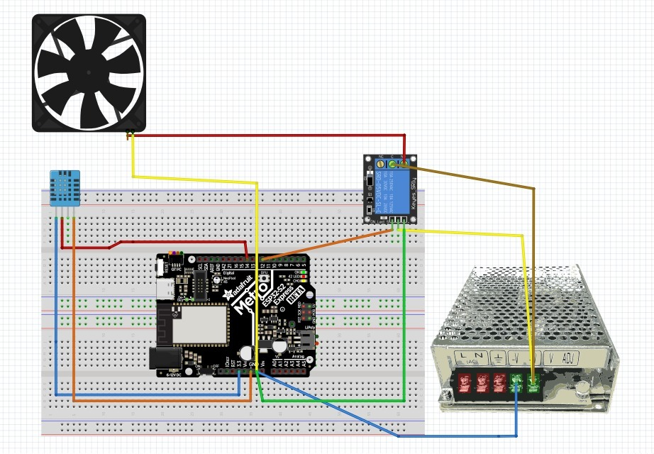

# 🌡️ Proyecto: Control de Temperatura con Ventilador (ESP32 + MicroPython)

## 🔧 Descripción general
Este proyecto implementa un **sistema de control de temperatura** usando un **ESP32** y un sensor **DHT11**. Cuando la temperatura supera un **límite configurado (30 °C)**, se activa un **ventilador** a través de un **relé**. Cuando la temperatura desciende por debajo del límite, el ventilador se apaga.

---

## 🛠 Componentes utilizados
- ESP32 (DevKit v1 o similar)
- Sensor DHT11 (temperatura y humedad)
- Módulo relé (para controlar el ventilador)
- Ventilador (o carga equivalente)
- Cables y protoboard
- Alimentación 5V por USB

---

## 🔌 Diagrama de conexión
- DHT11:
  - Datos → `GPIO14`
  - VCC → 3V3 o 5V (según módulo)
  - GND → GND
- Relé/ventilador:
  - Señal de control del relé → `GPIO12`
  - Contactos del relé en serie con el ventilador y su fuente

> Nota: verifica si tu relé es activo-alto o activo-bajo y ajusta `rele.value()` en consecuencia.

---

## 📲 Funcionamiento
- Se leen periódicamente los valores del DHT11: **temperatura** y **humedad**.
- Si `temperatura >= 30 °C` → se **enciende** el ventilador (`GPIO12` en ON).
- Si `temperatura < 30 °C` → se **apaga** el ventilador.
- Se imprime por consola la lectura y el estado del ventilador cada 2 s.

  #video

---

## 🧩 Explicación del código
- Sensor: `dht.DHT11(Pin(14))` y `sensor.measure()` para actualizar las lecturas.
- Relé: `Pin(12, Pin.OUT)` inicializado en apagado.
- Umbral: `Limite_temperatura = 30` (ajustable).
- Bucle principal:
  - Lee `temperatura` y `humedad`.
  - Controla el relé según el umbral.
  - Maneja excepciones `OSError` en caso de error de lectura del DHT.
  - Espera `2 s` entre iteraciones.

---

## ▶️ Cómo usar
1. Flashea MicroPython en tu ESP32 (por ejemplo con Thonny).
2. Conecta el circuito según el diagrama.
3. Copia `main.py` a la raíz del ESP32.
4. Ajusta `Limite_temperatura` si deseas otro valor de setpoint.
5. Ejecuta `main.py` y monitorea las lecturas por consola.

---

## ✅ Conclusión
Un proyecto sencillo y práctico para control de temperatura con **DHT11** y **relé** en **MicroPython**. Es una base ideal para sistemas HVAC, control ambiental o domótica.

## 👥 Integrantes
- Romano, Ivan
- Lazarte, Emanuel
