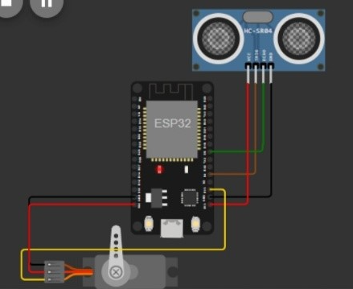
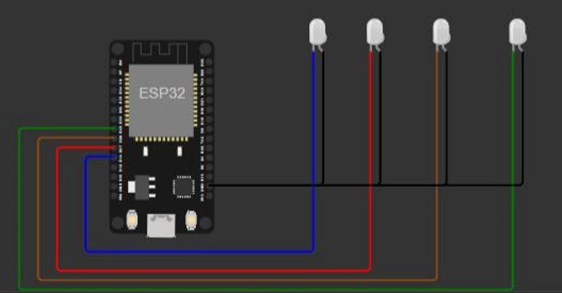

# 🏠 Proyecto: Acceso Domótico – Semáforo de Ingreso, Portón Ultrasónico y Mini Domótica (ESP32 + MicroPython)

## 🔧 Descripción general
Este proyecto unifica tres automatizaciones para el acceso y control del hogar, implementadas con **ESP32** y **MicroPython**:
- Semáforo de acceso + luz de aviso por sensor magnético
- Portón/barrera automática activada por sensor **ultrasónico**
- Mini domótica: control web de 4 LEDs mediante servidor HTTP en el ESP32

---

## 🛠 Componentes utilizados
- ESP32 (DevKit v1 o similar)
- LEDs (rojo, amarillo, verde y uno adicional para aviso; 4 LEDs controlados por web)
- Sensor magnético (reed switch) para ventana/puerta
- Sensor ultrasónico HC-SR04
- Servomotor (barrera/portón)
- Protoboard, resistencias y cables de conexión
- Alimentación por USB/5V

---

## 🔌 Diagrama de conexión (resumen)
### 1) Semáforo de acceso y luz de aviso
- LEDs semáforo (según `semaforo_acceso/main.py`):
  - Rojo → `GPIO18`
  - Amarillo → `GPIO19`
  - Verde → `GPIO21`
- Luz de aviso (LED blanco) → `GPIO33`
- Sensor magnético:
  - Señal → `GPIO34` (entrada con `Pin.PULL_UP`)
  - Otro terminal → GND

### 2) Portón/barrera ultrasónica
- Servomotor (PWM):
  - Señal → `GPIO19` (50 Hz recomendado; script actual usa 40 Hz)
  - VCC → 5V, GND → GND (compartir tierra con ESP32)
- HC-SR04:
  - Trigger → `GPIO4`
  - Echo → `GPIO5`

### 3) Mini domótica (control web de LEDs)
- LEDs controlados por web:
  - `GPIO14`, `GPIO27`, `GPIO26`, `GPIO25`
- Red WiFi: configuración en `conectar_wifi()` (SSID/clave)

> Nota general: comparte GND entre todos los módulos. Considera fuente separada para el servo si demanda corriente.

---

## 📲 Funcionamiento
### 1) Semáforo de acceso
- Ciclo de luces controlado por estado y contador:
  - Rojo: ~3 s
  - Amarillo: ~1 s
  - Verde: ~5 s (en código; README previo indicaba 3 s)
- Luz de aviso por sensor magnético:
  - Si el sensor lee 1 (entrada con `PULL_UP`), se enciende la luz de aviso (`GPIO33`).
  - Si lee 0, se apaga.

### 2) Portón ultrasónico
- Mide la distancia continuamente con el HC-SR04.
- Si la distancia es menor al umbral → abre la barrera moviendo el servo a posición de apertura.
- Si es mayor o no hay objeto cercano → cierra la barrera.
- El ejemplo actual usa umbral de 30 cm y alterna posiciones con `duty_ns` cada 2 s.

### 3) Mini domótica (servidor web)
- Conexión WiFi: el ESP32 se conecta en modo estación y muestra IP/gateway en consola.
- Servidor HTTP en puerto 80: recibe peticiones y conmuta los 4 LEDs.
- Interfaz web: HTML dinámico con botones ON/OFF e íconos que reflejan el estado de cada LED.

  
  https://github.com/user-attachments/assets/b41a4bb8-3263-450a-9316-25bd90e9aa74

---

## 🧩 Explicación del código
### 1) Semáforo
- Entradas/salidas: `Pin.OUT` para LEDs y `Pin.IN` con `Pin.PULL_UP` para sensor magnético.
- Lógica de estados: variable `estado` (0=rojo, 1=amarillo, 2=verde) más `contador` con `sleep(1)` para temporizar.
- La luz de aviso se controla en paralelo leyendo `sensor.value()` en cada iteración.

### 2) Portón
- Sensor: clase `HCSR04(trigger_pin=4, echo_pin=5)`, lectura con `distance_cm()`.
- Servo: `PWM(Pin(19))` con `freq(40)` y control por `duty_ns(...)` para posiciones de apertura/cierre.
- Umbral recomendando: 20–30 cm; el script actual utiliza 30 cm y un período de muestreo de 2 s.

### 3) Mini domótica
- WiFi: `network.WLAN(STA_IF)` con intento de conexión y timeout, impresión de IP/gateway.
- Web: `socket` TCP en puerto 80, parseo de rutas `/?ledX=on/off` para cambiar `Pin.OUT`.
- UI: función `web_page()` genera HTML con estado e íconos SVG para LEDs.

---

## ▶️ Cómo usar
1. Flashea MicroPython en tu ESP32 (Thonny u otra herramienta).
2. Conecta los tres circuitos según los diagramas de cada módulo.
3. Carga los códigos en sus carpetas o unifícalos si deseas una integración total.
4. Ajusta SSID/clave WiFi en `casa_domotica`. Ajusta tiempos del semáforo y umbral del portón según tu instalación.
5. Asegura alimentación 5V estable para el servo y comparte GND con el ESP32.
6. Ejecuta y prueba cada módulo; para la domótica, abre en el navegador la IP mostrada en consola.

---

## ✅ Conclusión
La solución integra señalización de acceso, control de barrera y un módulo de domótica web, demostrando control de GPIO, PWM, medición ultrasónica y servicios de red con **MicroPython**. Base ideal para expandir hacia control horario, autenticación web o panel centralizado.

## 👥 Integrantes
- Rus, Pablo
- Saravia, Sofia
- Suárez, Cristian
- Medina, Gabriel
