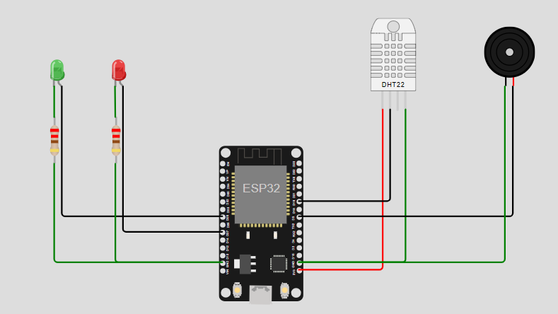

# 🔔 Proyecto: Alarma con Indicador de Temperatura y Humedad (ESP32 + MicroPython)

## 🔧 Descripción general
Este proyecto implementa un sistema de **monitoreo ambiental** que mide **temperatura** y **humedad** con un sensor **DHT22**. Cuando cualquiera de las variables se encuentra **fuera de su rango aceptable**, se enciende un **LED indicador** y se activa un **buzzer** como alarma audible durante un tiempo breve.

- Sensor: DHT22 en `GPIO19`
- Indicadores: LED rojo (temperatura) en `GPIO27` y LED verde (humedad) en `GPIO25`
- Alarma: Buzzer por `PWM` en `GPIO5`

---

## 🛠 Componentes utilizados
- ESP32 (DevKit v1 o similar)
- Sensor DHT22
- 2 LEDs (rojo para temperatura, verde para humedad)
- 2 resistencias para LEDs (220–330 Ω)
- Buzzer pasivo (controlado por PWM)
- Cables y protoboard
- Alimentación por USB (5 V)

---

## 🔌 Diagrama de conexión
- DHT22:
  - `DATA` → GPIO19
  - `VCC` → 3V3
  - `GND` → GND
- LED Temperatura (Rojo):
  - Ánodo → GPIO27 (con resistencia en serie)
  - Cátodo → GND
- LED Humedad (Verde):
  - Ánodo → GPIO25 (con resistencia en serie)
  - Cátodo → GND
- Buzzer (PWM):
  - Señal → GPIO5
  - GND → GND



---

## 📲 Funcionamiento
1. El sistema mide temperatura y humedad cada segundo.
2. Evalúa si los valores están dentro de los rangos definidos:
   - Temperatura OK: entre 10 °C y 13 °C
   - Humedad OK: entre 85 % y 95 %
3. Si alguno está fuera de rango:
   - Enciende el LED correspondiente (rojo para temperatura, verde para humedad).
   - Activa el buzzer durante ~2 segundos.
   - Luego apaga el buzzer y los LEDs.
4. Imprime por consola los valores y las alertas correspondientes.

Rangos configurables en el código:

```23:27:proyectos/Vera_Galvan/main.py
print("Temperatura: {:.1f} °C, Humedad: {:.1f}%".format(temperatura, humedad))
alerta_temperatura = temperatura < 10 or temperatura > 13
alerta_humedad = humedad < 85 or humedad > 95
```

## 🎥 Video del proyecto
- [Presentación y funcionamiento](https://youtu.be/ORx1zrJhkdE?si=hEtT3WuCqr8QTehu)

---

## 🧩 Explicación del código
- Inicialización de pines y periféricos:

```5:8:proyectos/Vera_Galvan/main.py
sensor = dht.DHT22(Pin(19))
buzzer_alarma = PWM(Pin(5), freq=750, duty=0)
rojo_temperatura = Pin(27, Pin.OUT)  
verde_humedad = Pin(25, Pin.OUT)
```

- Funciones auxiliares:
  - `activar_alarma()`: fija `freq=750 Hz` y `duty` medio para hacer sonar el buzzer.
  - `desactivar_alarma()`: pone `duty=0` para silenciar.
- Bucle principal: mide con `sensor.measure()`, obtiene `temperature()` y `humidity()`, evalúa rangos, enciende LEDs/buzzer si corresponde y espera 1 s entre lecturas.

---

## ▶️ Cómo usar
1. Flashea MicroPython en tu ESP32 (por ejemplo, con Thonny).
2. Cablea el circuito siguiendo el diagrama anterior.
3. Copia `main.py` a la raíz del ESP32.
4. Reinicia la placa o ejecuta `main.py`.
5. Abre la consola serial para ver los valores y mensajes de alerta.

---

## ✅ Conclusión
Un sistema sencillo y eficaz para **supervisión ambiental** con alertas visuales y sonoras. Los **umbrales son fácilmente ajustables** para adaptarse a cámaras, bodegas o ambientes de cultivo.

---

## 👥 Integrantes
- Vera, Bruno Alejandro
- Galván, Matias Fernando